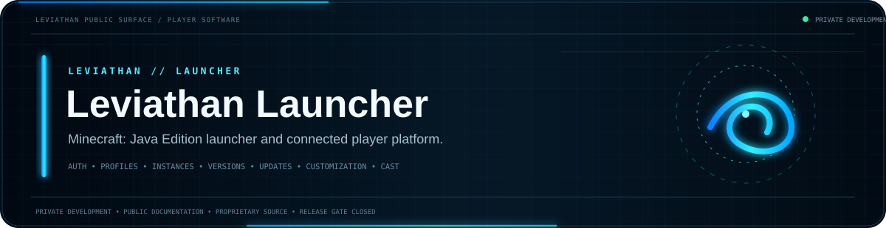
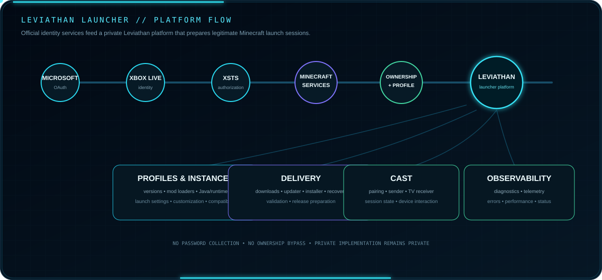

 

**A modern third-party desktop launcher for legitimate Minecraft: Java Edition players.**

[Documentation](https://github.com/Lapinite/Leviathan-Docs) · [Security](SECURITY.md) · [Support](SUPPORT.md) · [Legal](LEGAL.md) · [License](LICENSE)

> **Internal development only. No public launcher, installer, beta build, package, or general-access download is available.**

## Platform architecture

Public architecture only. Proprietary source, private endpoints, credentials, schemas and sensitive implementation details remain private.

## Current state

| Area | State |
| --- | --- |
| Microsoft + Xbox + XSTS + Minecraft authentication | Integrated |
| Minecraft AppID review | Approved |
| Production authentication validation | In progress |
| Installation + instance management | In progress |
| Customization + cosmetics | In development |
| Updates | In development |
| Cast sender / TV receiver validation | In progress |
| Compatibility + regression testing | In progress |
| Public beta | Not started |
| Stable public release | Not started |

Leviathan uses legitimate Microsoft authentication and does not bypass ownership, licensing, entitlement checks, account security or Minecraft service requirements.

## Public developer network

[Docs](https://github.com/Lapinite/Leviathan-Docs) · [API Docs](https://github.com/Lapinite/Leviathan-API-Docs) · [SDK](https://github.com/Lapinite/Leviathan-SDK) · [Examples](https://github.com/Lapinite/Leviathan-Examples) · [Integrations](https://github.com/Lapinite/Leviathan-Integrations) · [Server Tools](https://github.com/Lapinite/Leviathan-Server-Tools) · [Status](https://github.com/Lapinite/Leviathan-Status)

## Security + legal

The public repository must not contain credentials, tokens, private keys, signing material, recovery material, private endpoints, database credentials, personal information or internal infrastructure details.

Leviathan Launcher is proprietary software. External code contributions are not currently accepted unless explicitly authorized. See [SECURITY.md](SECURITY.md), [LEGAL.md](LEGAL.md) and [LICENSE](LICENSE).

Leviathan is an independent third-party project and is not affiliated with, sponsored by, endorsed by or operated by Microsoft, Mojang Studios, Xbox or Minecraft.
